# JustResponsiveUi

[](LICENSE)


<html>
  <h2 align="center">
    
  </h2>
</html>

JustResponsiveUi is a minimal Android app that demonstrates building adaptive Jetpack Compose UIs
for phones and tablets (portrait and landscape). It includes separate Login and Register flows with
shared domain validation, MVVM ViewModel + StateFlow, and Dagger Hilt dependency injection.

## Overview

- Small, focused codebase that illustrates adaptive Compose layouts, MVVM separation, and
  single-source validation logic for authentication.

## Screenshots

<details>
<summary>Portrait — Mobile phone</summary>

<p align="center">

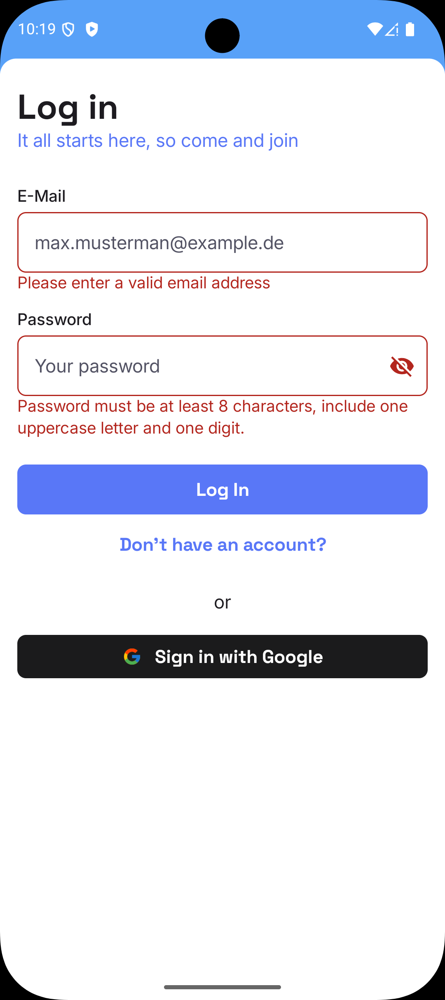
</p>

<p align="center">
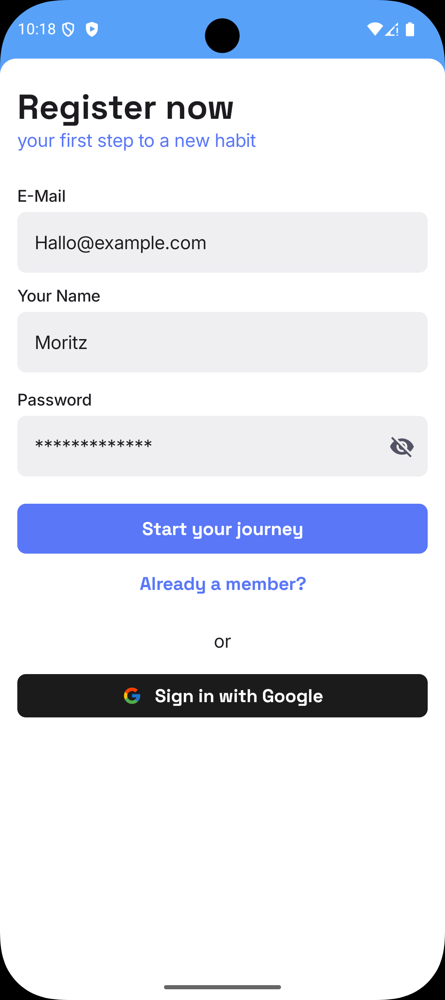

</p>

</details>

<details>
<summary>Portrait — Tablet</summary>

<p align="center">
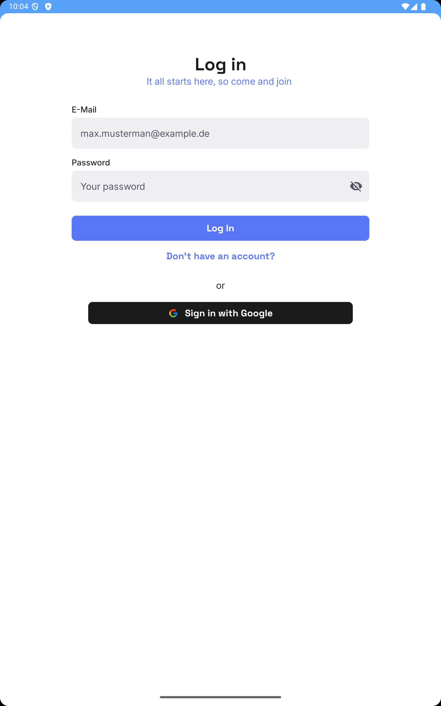
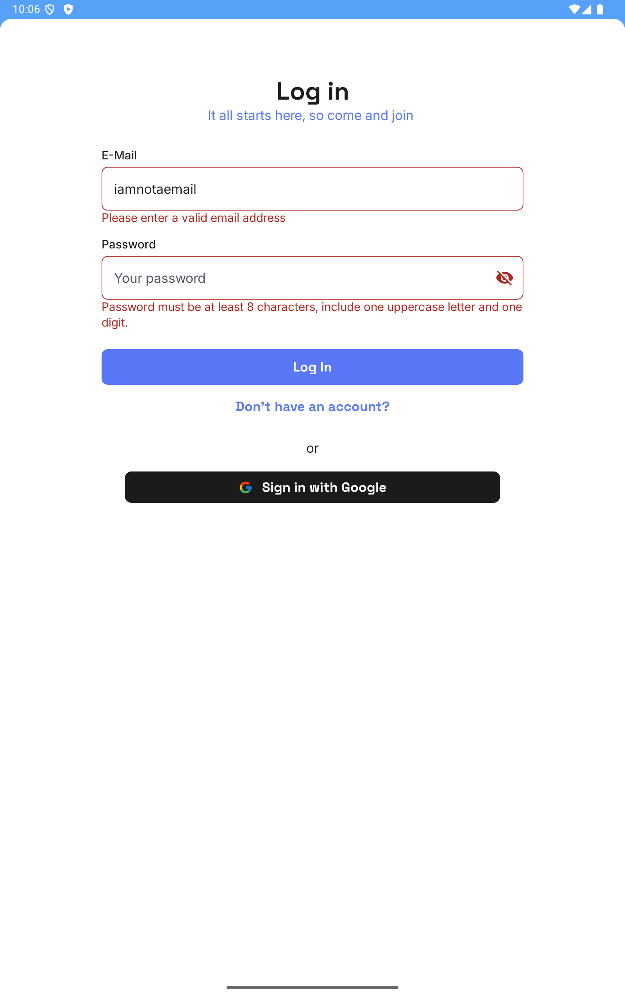
</p>

<p align="center">
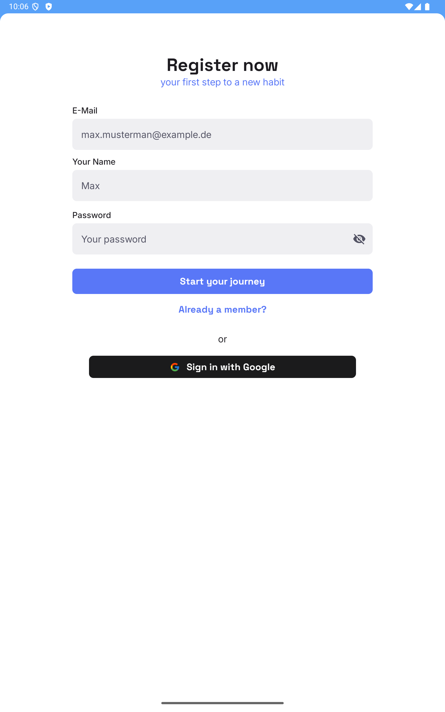
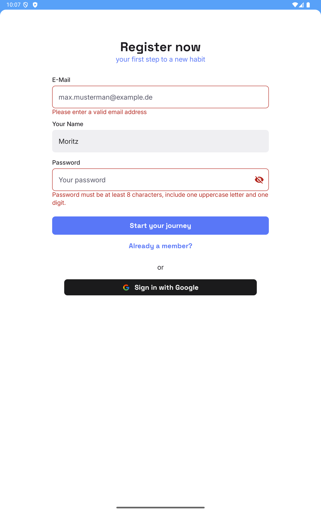
</p>

</details>

<details>
<summary>Landscape — Mobile phone</summary>

<p align="center">

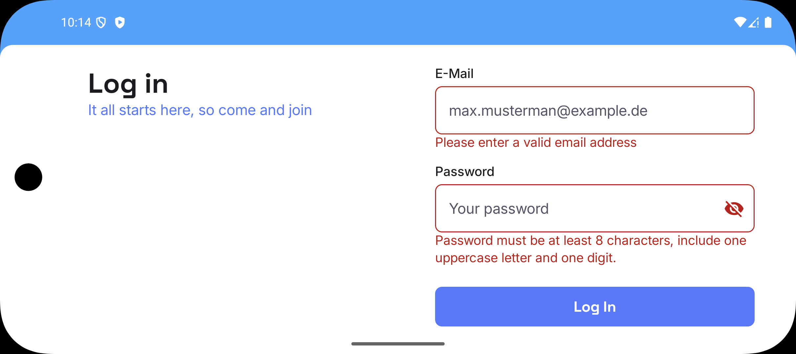
</p>

<p align="center">
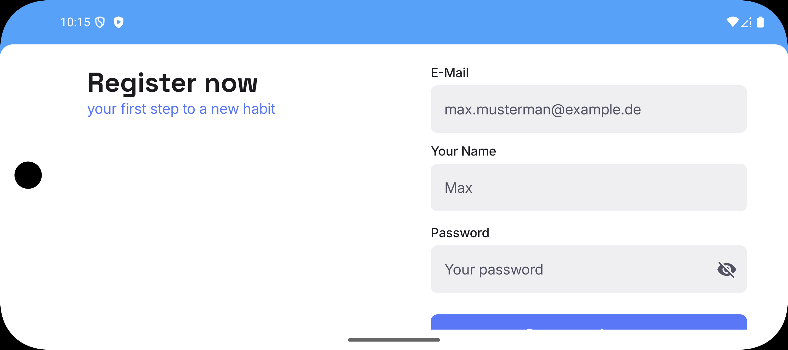
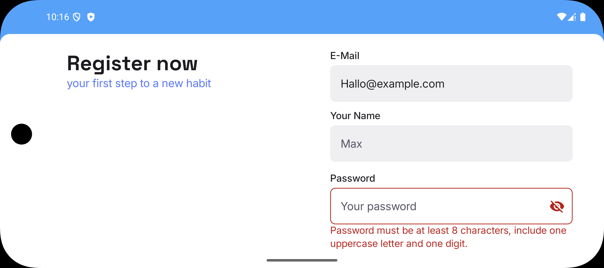
</p>

</details>

<details>
<summary>Landscape — Tablet</summary>

<p align="center">
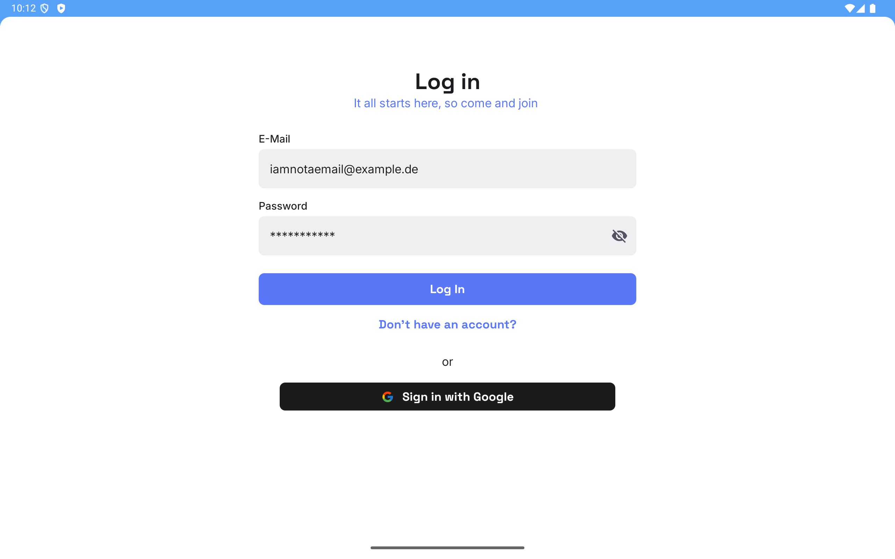
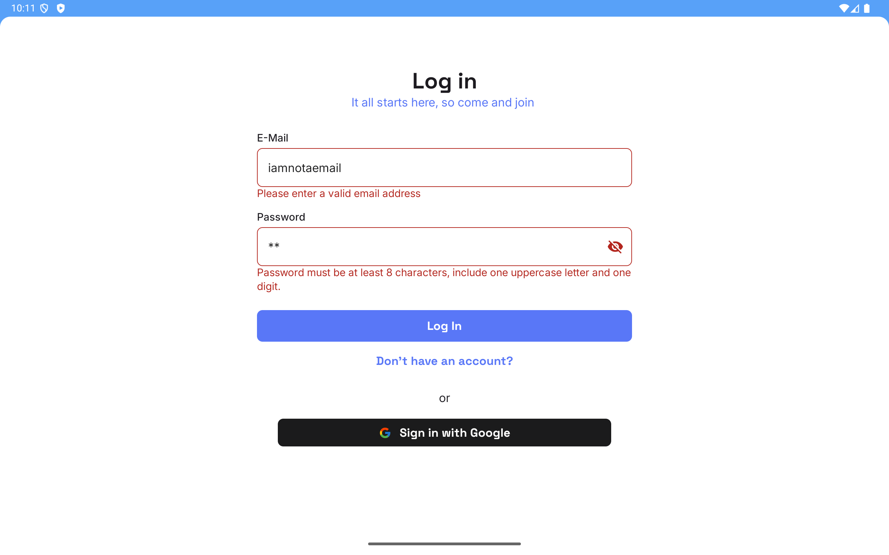
</p>

<p align="center">

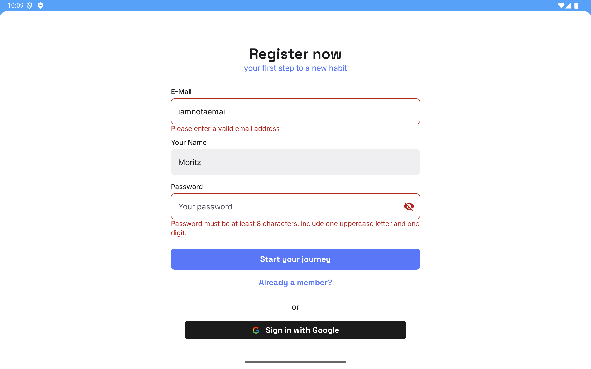
</p>

</details>

## Architecture

- Pattern: MVVM — `ViewModel` holds UI state and exposes `StateFlow`; composables render state and
  emit events.
- Layers: domain (use-cases), presentation (Compose screens + ViewModels), DI modules.

## Tech Stack

- Kotlin
- Jetpack Compose (Material3)
- Dagger Hilt (DI)
- Navigation3 (compose-compatible)
- Kotlin Coroutines, StateFlow
- Gradle (wrapper)

## Key Locations

- Auth root: `app/src/main/java/com/feevlic/justresponsiveui/auth`
- Screens: `auth/login` and `auth/register`
- Shared domain use-cases: `auth/shared/domain/usecase`
- Navigation entry: `auth/shared/navigation/AuthNavigation.kt`
- Shared state: `auth/shared/presentation/SharedAuthViewModel.kt`

## Build and run

- Prerequisites: Android Studio, Android SDK, emulator or physical device
- Build:

```
./gradlew clean assembleDebug
```

- Install on device/emulator:

```
./gradlew installDebug
```
