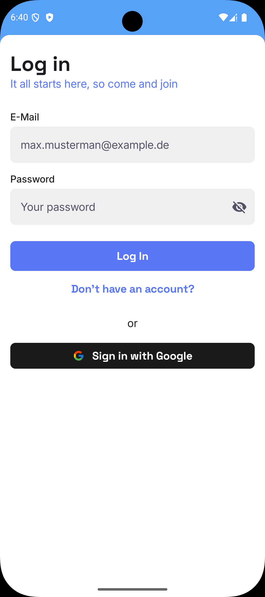
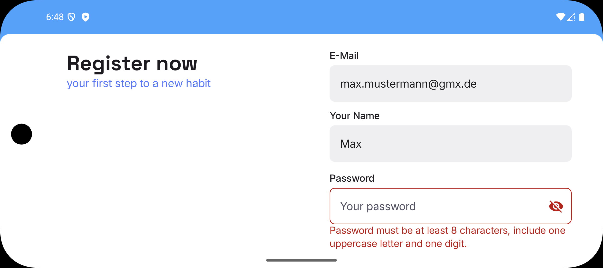
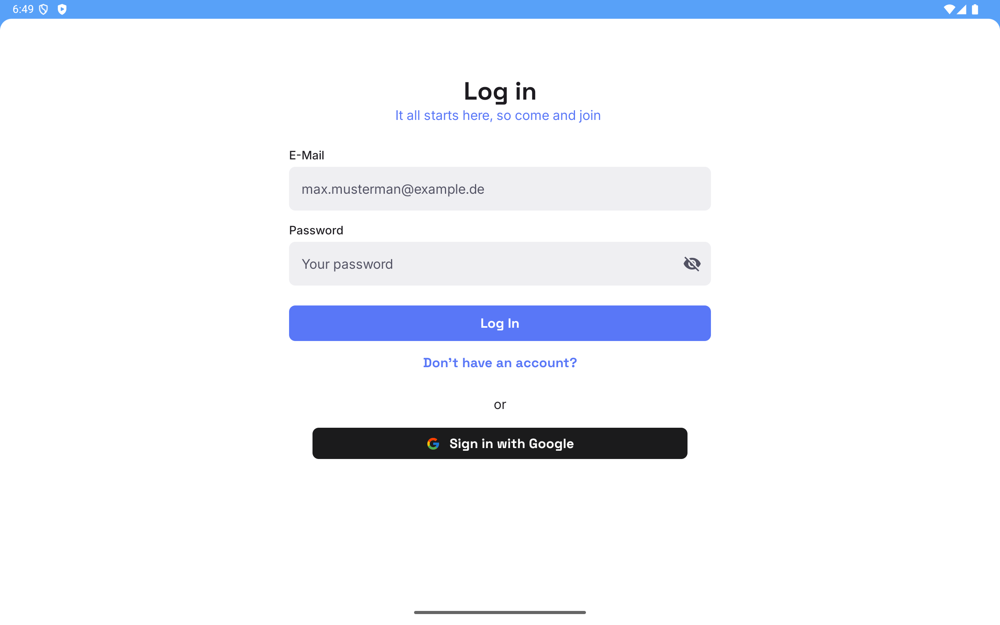
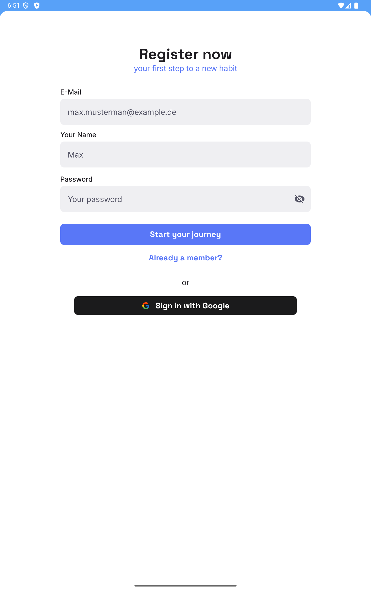

JustResponsiveUI

<p align="center"> <table cellspacing="12" cellpadding="0" align="center"> <tr> <td> <a href="screenshots/LoginFlow_Video.mp4"> <div style="width:320px;height:320px;display:flex;align-items:center;justify-content:center;background:#ffffff;">  </div> </a> </td> <td> <a href="screenshots/LoginFlow_Video.mp4"> <div style="width:320px;height:320px;display:flex;align-items:center;justify-content:center;background:#ffffff;">  </div> </a> </td> </tr> <tr> <td> <a href="screenshots/LoginFlow_Video.mp4"> <div style="width:320px;height:320px;display:flex;align-items:center;justify-content:center;background:#ffffff;">  </div> </a> </td> <td> <a href="screenshots/LoginFlow_Video.mp4"> <div style="width:320px;height:320px;display:flex;align-items:center;justify-content:center;background:#ffffff;">  </div> </a> </td> </tr> </table> </p>


Minimal Android sample demonstrating responsive Jetpack Compose UI and cleanly separated
authentication flows (Login / Register), with shared domain validation and dependency injection.

Overview

- Small, focused codebase that illustrates adaptive Compose layouts, MVVM separation, and
  single-source validation logic for authentication.

Architecture

- Pattern: MVVM — `ViewModel` holds UI state and exposes `StateFlow`; composables render state and
  emit events.
- Layers: domain (use-cases), presentation (Compose screens + ViewModels), DI modules.

Tech stack

- Kotlin
- Jetpack Compose (Material3)
- Dagger Hilt (DI)
- Navigation3 (compose-compatible)
- Kotlin Coroutines, StateFlow
- Gradle (wrapper)

Key locations

- Auth root: `app/src/main/java/com/feevlic/justresponsiveui/auth`
- Screens: `auth/login` and `auth/register`
- Shared domain use-cases: `auth/shared/domain/usecase`
- Navigation entry: `auth/shared/navigation/AuthNavigation.kt`
- Shared state: `auth/shared/presentation/SharedAuthViewModel.kt`

Build and run

- Prerequisites: Android Studio (stable), Android SDK, JDK.
- Build:

```
./gradlew clean assembleDebug
```

- Install on device/emulator:

```
./gradlew installDebug
```
